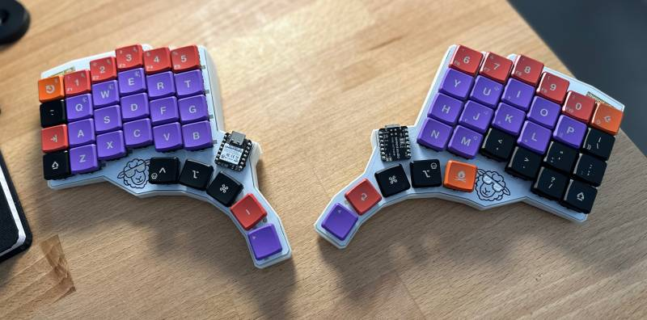
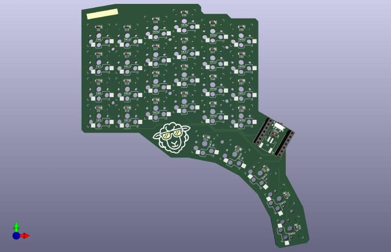
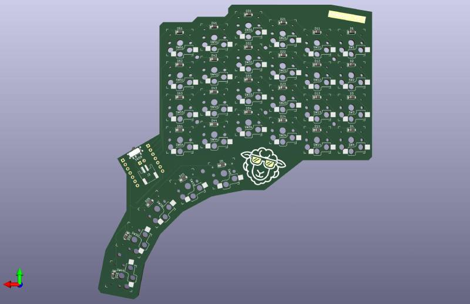

# Shweep

A 58 key, low-profile, split, ortholinear(ish), keyboard for the XIAO nRF52840.

> [!NOTE]
> Everything required to build a Shweep is available here, but there is no build guide (yet). If you've done this sort of thing before then you shouldn't have any trouble, just note that D35 and D45 (likewise D40 and D50 for the RHS) point in the opposite direction to other diodes. Also, the MCU is flipped on the RHS board.

## Firmware

[ZMK firmware is available here](https://github.com/brendan-myers/shweep-shield-module)

## PCB

Most PCB fabs require a minimum order of 5 boards; this board is reversable so you can build both halves without having to place a different order for each.

## BOM (per side)

- 1x Seeed Studio
- 29x Kailh choc v1 switches
- 29x SOD-123 diodes
- (optional) 29x Kailh sockets (if you don't want to solder switches directly to the board)
- (optional) 2x 7x1 2.54m female headers (if you don't want to solder the MCU directly to the board).
- (optional) 1x [PCM12 SPDT](https://jlcpcb.com/partdetail/ck-PCM12SMTR/C221841) switch
- (optional) 1x [JST S2B-PH-SM4-TB](https://jlcpcb.com/partdetail/JST-S2B_PH_SM4_TB_LF_SN/C295747) battery socket

## Todos

- Build guide.
- (PCB) Use reversible footprint for Kailh sockets (instead of 2 overlapping single-sided footprints).
- (PCB) Fully connected diodes, ie allow diode for each key to be on either side of the board instead of forcing them to be on the same side as the Kailh sockets. This is cheaper to manufacture (PCBA is less expensive when components are only on one side).
- (PCB) Include through-hole diodes.
- (PCB) Investigate: charging battery without board being switched "on".
